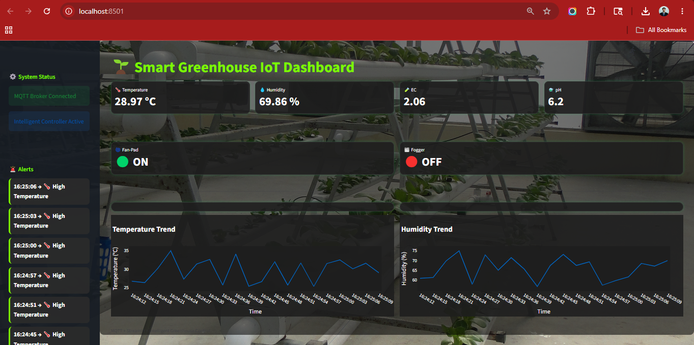

# Smart Greenhouse IoT Dashboard

Real-time Smart Greenhouse Monitoring and Intelligent Control System using MQTT, Streamlit, Plotly and Python.

---
## 📸 Dashboard Preview



# Features

## Real-Time Sensor Monitoring

The dashboard continuously monitors:

- Temperature
- Relative Humidity
- EC (Electrical Conductivity)
- pH

---

## Intelligent Greenhouse Controller

The intelligent controller automatically responds to sensor conditions.

### Example Logic

| Condition | Action |
|---|---|
| Temperature > 30°C | Fan-Pad ON |
| Humidity < 60% | Fogger ON |
| EC < 1.5 | Nutrient Dosing ON |
| pH > 6.5 | Acid Dosing ON |

---

# MQTT-Based Architecture

The system uses MQTT publish-subscribe communication.

## MQTT Topics

| Topic | Purpose |
|---|---|
| greenhouse/temp | Temperature data |
| greenhouse/rh | Humidity data |
| greenhouse/ec | EC data |
| greenhouse/ph | pH data |
| greenhouse/fan_status | Fan status |
| greenhouse/fogger_status | Fogger status |

---

# Dashboard Features

- Live sensor monitoring
- Intelligent actuator control
- Real-time trend charts
- Timestamped alerts
- Industrial-style UI
- Greenhouse background theme
- MQTT telemetry visualization
- Real-time actuator status display

---

# System Architecture

```text
Sensor Publisher
       ↓
MQTT Broker
       ↓
Intelligent Controller
       ↓
Actuator Status Topics
       ↓
Streamlit Dashboard
```
---

#  Project Structure

```text
smart-greenhouse-iot-dashboard/
│
├── dashboard.py
├── greenhouse_publisher.py
├── intelligent_controller.py
├── greenhouse_bg.jpg
└── README.md
```

---

#  Installation

Install required Python packages:

```bash
py -m pip install paho-mqtt
py -m pip install streamlit
py -m pip install pandas
py -m pip install plotly
py -m pip install streamlit-autorefresh
```

---

#  Running the System

## Terminal 1 — Greenhouse Publisher

```bash
cd "%USERPROFILE%\Documents\mqtt_greenhouse"
py greenhouse_publisher.py
```

---

## Terminal 2 — Intelligent Controller

```bash
cd "%USERPROFILE%\Documents\mqtt_greenhouse"
py intelligent_controller.py
```

---

## Terminal 3 — Dashboard

```bash
cd "%USERPROFILE%\Documents\mqtt_greenhouse"
py -m streamlit run dashboard.py
```

---

#  Dashboard Capabilities

## Real-Time Analytics

The dashboard includes:

- Temperature trend graph
- Humidity trend graph
- Live telemetry visualization
- Real-time alerts with timestamps

---

#  UI Enhancements

The dashboard includes:

- Dark industrial UI theme
- Glassmorphism-inspired cards
- Rounded chart panels
- Greenhouse background image
- Professional telemetry appearance

---

#  Engineering Concepts Practiced

## MQTT Concepts

- Publish-subscribe architecture
- Topic hierarchy
- Real-time telemetry
- Callback-based communication

---

## IoT Concepts

- Environmental monitoring
- Intelligent automation
- Actuator control
- Real-time sensor systems

---

## Dashboard Engineering

- Streamlit UI development
- Plotly visualization
- Real-time analytics
- Custom CSS styling
- IoT dashboard design

---

#  Future Improvements

Planned enhancements:

- Plotly Dash migration
- Database logging
- Historical analytics
- AI-based prediction
- Cloud deployment
- Multi-greenhouse support

---


#  Author

Dr. Adarsha Gopalakrishna Bhat

Ph.D. Soil and Water Conservation Engineering  
ICAR-IARI, New Delhi
